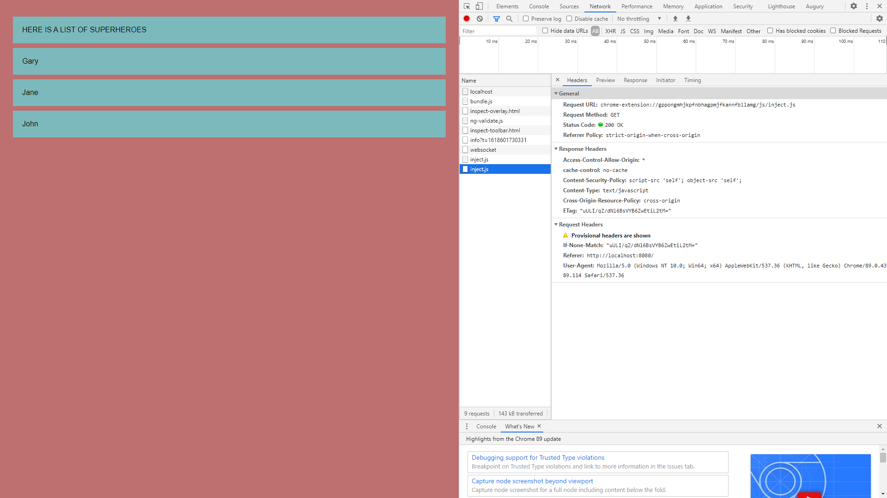

# :zap: RxJS Learn

* Practise using Reactive X with javascript (RxJS) without using a framework such as Angular.
* [Webpack](https://webpack.js.org/) is used to bundle this javascript application.
* Updates due to rxjs updates - pluck requires pipe, Observer.create is now new Observer.
* Webpack config. & package.json files updated to remove errors
* **Note:** to open web links in a new window use: _ctrl+click on link_


## :page_facing_up: Table of contents

* [:zap: RxJS Learn](#zap-rxjs-learn)
  * [:page_facing_up: Table of contents](#page_facing_up-table-of-contents)
  * [:books: General info](#books-general-info)
  * [:camera: Screenshots](#camera-screenshots)
  * [:signal_strength: Technologies](#signal_strength-technologies)
  * [:floppy_disk: Setup](#floppy_disk-setup)
  * [:computer: Code Examples](#computer-code-examples)
  * [:cool: Features](#cool-features)
  * [:clipboard: Status & To-Do List](#clipboard-status--to-do-list)
  * [:clap: Inspiration](#clap-inspiration)
  * [:envelope: Contact](#envelope-contact)

## :books: General info

RxJS is an API for asynchronous programming using observables. It includes:

1. streams (values or events emitted over time)
2. observables (facilitates the stream) and observers
3. subscriptions (a disposable resource, such as the execution of an Observable)
4. subjects (behaviour, replay (emit old values to new subscribers), async: different types of observable) and
5. operators (methods you can use on Observables and Subjects).

**Webpack** is a static module bundler for modern JavaScript applications. When webpack processes your application, it internally builds a dependency graph which maps every module your project needs and generates one or more bundles. _Since version 4.0.0, webpack does not require a configuration file for default configurations. However in this case a webpack.config.js file was required to extend the project functionality.

## :camera: Screenshots

.

## :signal_strength: Technologies

* [RxJS v6](https://rxjs.dev/) used to handle datastreams and propagation of change using observables.
* [webpack v5](https://webpack.js.org/) to bundle the module, including dependencies into a single javascript file to be pulled in by the index.html file.

## :floppy_disk: Setup

* Run `npm run start:dev` for a dev server. Navigate to `http://localhost:8080/`. The app will automatically reload if you change any of the source files.

## :computer: Code Examples

```javascript
import { Observable } from "rxjs/Observable";
import { map } from 'rxjs/operators';
import { from } from "rxjs/Observable/from";
import "rxjs/add/operator/pluck";

//using the map operator (note use of pipe function in new version 6)
new Observable((observer: any) => {
  observer.next("Here is a list of superheroes");
})
  .pipe(map((val: any) => val.toUpperCase()))
  .subscribe((x: any) => addItem(x));

//using the pluck operator
from([
  { first: "Gary", last: "Simon", age: "32" },
  { first: "Jane", last: "Bates", age: "34" },
  { first: "John", last: "Kent", age: "36" },
])
  .pipe(pluck("first"))
  .subscribe((x: any) => addItem(x));

// function for showing the values:
function addItem(val:any) {
    const node = document.createElement("li");
    const textnode = document.createTextNode(val);
    node.appendChild(textnode);
    document.getElementById("output").appendChild(node);
}

```

## :cool: Features

* Changing the value in the [pluck](http://reactivex.io/rxjs/class/es6/Observable.js~Observable.html#instance-method-pluck) method means a different property is selected from the nested object.

## :clipboard: Status & To-Do List

* Status: Working. Updated april 2021
* To-Do: Code could be expanded to learn about other methods in RxJS.

## :clap: Inspiration

* [Gary Simon's 'A Comprehensive RxJS Tutorial - Learn ReactiveX for JavaScript'](https://coursetro.com/courses/25/A-Comprehensive-RxJS-Tutorial---Learn-ReactiveX-for-JavaScript-)

## :file_folder: License

* This project is licensed under the terms of the MIT license.

## :envelope: Contact

* Repo created by [ABateman](https://github.com/AndrewJBateman), email: gomezbateman@yahoo.com
